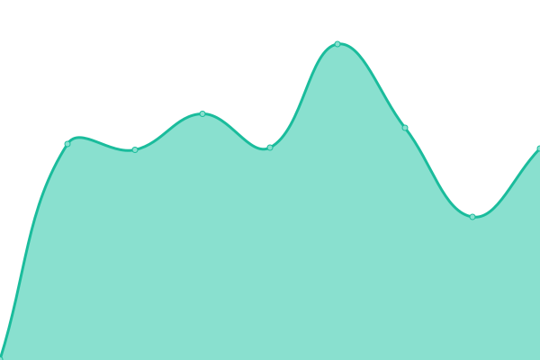
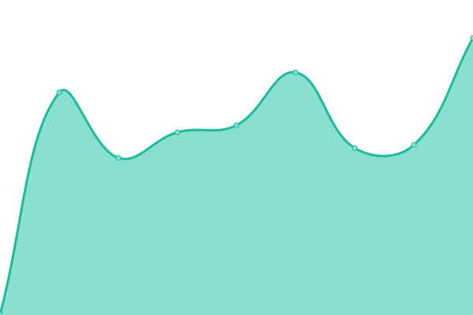
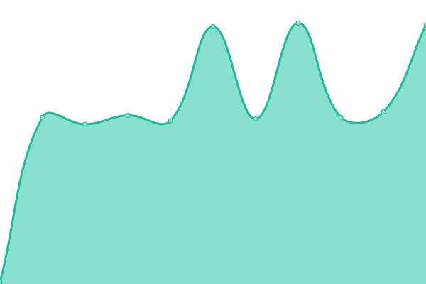

# [📈 Live Status](https://$MAIN_URL): <!--live status--> **🟧 Partial outage**

This repository contains the open-source uptime monitor and status page for [Nhat](https://$MAIN_URL), powered by [Upptime](https://github.com/upptime/upptime).

With [Upptime](https://upptime.js.org), you can get your own unlimited and free uptime monitor and status page, powered entirely by a GitHub repository. We use [Issues](https://github.com/mstcl/status/issues) as incident reports, [Actions](https://github.com/mstcl/status/actions) as uptime monitors, and [Pages](https://$MAIN_URL) for the status page.

<!--start: status pages-->
<!-- This summary is generated by Upptime (https://github.com/upptime/upptime) -->
<!-- Do not edit this manually, your changes will be overwritten -->
<!-- prettier-ignore -->
| URL | Status | History | Response Time | Uptime |
| --- | ------ | ------- | ------------- | ------ |
|  Lemmy | 🟥 Down | [lemmy.yml](https://github.com/mstcl/status/commits/HEAD/history/lemmy.yml) | 

 2435ms
     
 | 

<a href="https://status.bim.boats/history/lemmy">99.99%</a>
    

|  Piped (FE) | 🟥 Down | [piped-fe.yml](https://github.com/mstcl/status/commits/HEAD/history/piped-fe.yml) | 

 585ms
     
 | 

<a href="https://status.bim.boats/history/piped-fe">99.99%</a>
    

|  Piped (BE) | 🟥 Down | [piped-be.yml](https://github.com/mstcl/status/commits/HEAD/history/piped-be.yml) | 

 736ms
     
 | 

<a href="https://status.bim.boats/history/piped-be">99.99%</a>
    

|  Git | 🟥 Down | [git.yml](https://github.com/mstcl/status/commits/HEAD/history/git.yml) | 

 563ms
     
 | 

<a href="https://status.bim.boats/history/git">99.99%</a>
    

|  Blog | 🟥 Down | [blog.yml](https://github.com/mstcl/status/commits/HEAD/history/blog.yml) | 

 615ms
     
 | 

<a href="https://status.bim.boats/history/blog">99.99%</a>
    

|  Matrix | 🟥 Down | [matrix.yml](https://github.com/mstcl/status/commits/HEAD/history/matrix.yml) | 

 688ms
     
 | 

<a href="https://status.bim.boats/history/matrix">100.00%</a>
    

|  Slsk | 🟩 Up | [slsk.yml](https://github.com/mstcl/status/commits/HEAD/history/slsk.yml) | 

 139ms
     
 | 

<a href="https://status.bim.boats/history/slsk">100.00%</a>
    

|  Wd | 🟩 Up | [wd.yml](https://github.com/mstcl/status/commits/HEAD/history/wd.yml) | 

 580ms
     
 | 

<a href="https://status.bim.boats/history/wd">100.00%</a>
    

<!--end: status pages-->

[**Visit our status website →**](https://$MAIN_URL)

## 📄 License

- Powered by: [Upptime](https://github.com/upptime/upptime)
- Code: [MIT](./LICENSE) © [Nhat](https://$MAIN_URL)
- Data in the `./history` directory: [Open Database License](https://opendatacommons.org/licenses/odbl/1-0/)
